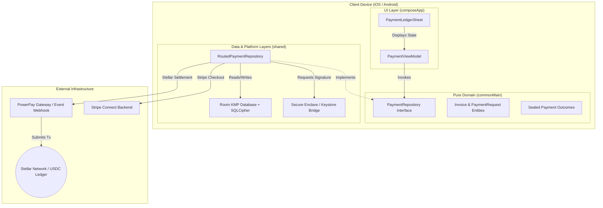

# Invoice Hammer

   

Invoice Hammer is a production-grade Kotlin Multiplatform (KMP) invoicing and payment system designed for independent contractors, trade professionals, and service merchants. It offers offline-first invoice staging, professional PDF generation, and multi-rail payment settlement (including Stripe Connect, Apple Pay, Google Pay, Card Terminals, Tap to Pay, and digital stablecoin rails) without centralized custody.

---

## 1. Executive Summary & Value Proposition

Traditional payment processors charge contractors high merchant fees, enforce arbitrary holding periods (2–5 business days), and introduce centralized custodial risks. 

**Invoice Hammer** addresses this by providing a flexible, multi-rail checkout system that gives contractors control:
* **Multi-Rail Flexibility**: Accept payments via Apple Pay, Google Pay, credit cards, on-site terminals, or digital stablecoins.
* **Instant Stablecoin Settlement**: Bypasses traditional banking latency with direct on-chain USDC settlement in seconds with near-zero network fees.
* **Non-Custodial Design**: Private keys and sensitive business data remain fully self-custodied. All signing and cryptographic operations occur locally.
* **Offline-First Workflow**: Stage invoices, manage client directories, and generate PDFs in the field even without internet connectivity.

---

## 2. Project Documentation & Demos

* **Public Repository**: [Invoice Hammer KMP Repository](https://gitlab.com/Justin1028c/invoice-hammer)
* **Hosted Developer Reference**: [Invoice Hammer Documentation Site](https://invoice-hammer-1f7efb.gitlab.io)

---

## 3. Architecture & Custody Model

Invoice Hammer leverages Kotlin Multiplatform (KMP) to share core business logic and storage models, while keeping key signing operations localized.

### Security & Custody Architecture
* **Local Transaction Signing**: Private keys never leave the client's device. For secure storage, key pairs are generated and stored in the **iOS Keychain (via Secure Enclave)** and **Android Keystore**, bridged through KMP expect/actual platform declarations.
* **Encrypted Storage**: Invoice data, client directories, and metadata are persisted locally using a Room KMP database encrypted with **SQLCipher**, preventing unauthorized access to business history on-device.

---

## 4. Key Features

1. **Offline Invoice Staging**: Create and edit professional invoices, manage client files, and catalog parts/services without active internet.
2. **Professional PDF Generation**: Generate clean, print-ready client invoices directly on-device using platform-specific rendering engines.
3. **Multi-Rail Checkout Options**:
   * **Stripe Connect & Card Links**: Hosted checkout screens for general credit card collection.
   * **Mobile Wallets**: Integrated Google Pay and Apple Pay checkouts.
   * **On-Site Collection**: Integrated Card Terminal, Tap to Pay (NFC), and Bluetooth reader support.
   * **USDC Rails**: Settle payments directly to a digital wallet within seconds.
4. **Passphrase-Secured Local Enclave**: Derived database keys are secured behind hardware-backed biometric authentication.

---

## 5. Technical Stack

* **Core Language**: 100% Kotlin (Kotlin Multiplatform).
* **UI Layer**: Compose Multiplatform for shared UI across Android and iOS.
* **Local Database**: Room KMP encrypted via SQLCipher.
* **Networking**: Ktor client (OkHttp engine on Android, Darwin engine on iOS).
* **Dependency Injection**: Koin framework.
* **Architecture**: Strict Clean Architecture separating pure domain models (`commonMain`) from platform and data boundary implementations.

---

## 6. Open Source & Licensing
Invoice Hammer is committed to the open-source ethos of the developer community. All codebase components, libraries, and platform bridging structures are fully open-source and licensed under the [Apache License 2.0](LICENSE).
