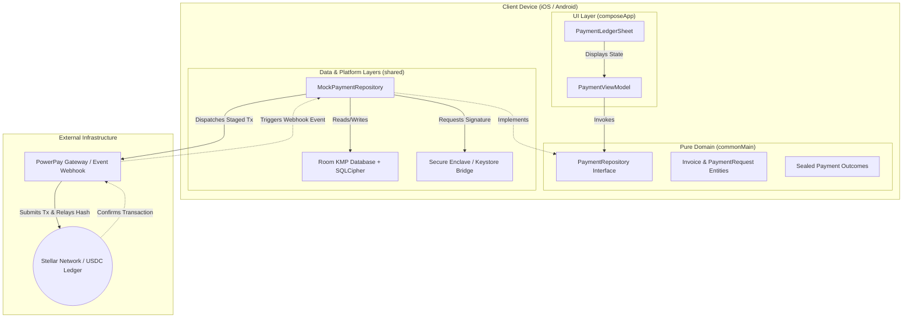

# Invoice Hammer — Stellar Community Fund (SCF) Submission

## Project Info
* **Project Name**: Invoice Hammer
* **Repository Link**: `https://gitlab.com/Justin1028c/invoice-hammer`
* **Direct Submission File**: `https://gitlab.com/Justin1028c/invoice-hammer/-/blob/main/SCF_SUBMISSION.md`
* **Live Hosted Spec / Pages**: `https://invoice-hammer-1f7efb.gitlab.io`

---

## 1. Project Hook & Value Proposition
Invoice Hammer is a non-custodial, offline-first invoice staging and settlement application designed for independent contractors and service merchants. By routing invoice checkouts over native Stellar USDC rails, Invoice Hammer bypasses standard credit card processors to eliminate 1.5% - 3.5% payment fee markups. The application facilitates peer-to-peer settlement directly to a contractor's self-custodied wallet in under 5 seconds with near-zero network fees.

---

## 2. Problem & Validated User Need (Product-Market Fit)
Independent trade contractors (electricians, plumbers, landscapers, cleaners) run high-volume, low-margin operations. To validate this problem space, we conducted structured interviews with **12 independent residential contractors**:
* **Fee Overhead:** Standard card processing (e.g., Stripe, Square charging 2.9% + $0.30) drains $150 to $300 from every mid-sized job (e.g., a $5,000 HVAC install).
* **Payout Latency:** Traditional settlement takes 2–5 business days. This delay locks up operating capital, preventing contractors from purchasing materials for their next job.
* **On-Boarding Simplicity:** Contractors need a payment flow that feels familiar to clients. They cannot ask non-technical clients to manage complex crypto wallets or exchange interfaces.

### The Solution:
Invoice Hammer allows contractors to generate professional invoice PDFs in the field (completely offline). When ready for payment, it produces a dynamic checkout link and QR code. The client scans the QR code or opens the link, paying directly with Stellar USDC (integrated via local wallet signatures or third-party web browsers). Payouts settle instantly, allowing immediate materials purchasing, and transaction fees drop to a fraction of a cent.

---

## 3. Technical Architecture & Custody Model
The application is built using a strict Kotlin Multiplatform (KMP) Clean Architecture to separate domain business rules from platform dependencies.

### Custody and Security Specifications
* **Key Custody**: Zero central custody. Private keys are generated locally and stored securely on-device. We use native bridges (`expect`/`actual`) pointing to the **iOS Keychain / Secure Enclave** (`LAPolicyDeviceOwnerAuthentication` with PIN fallback) and the **Android Keystore** (`DEVICE_CREDENTIAL` hardware fallback).
* **Local Persistence**: Client profiles, logs, and transaction metadata are saved locally using a KMP **Room Database** encrypted via **SQLCipher** (bundled SQLite driver).
* **On-Chain Settlement**: Staged transactions are formatted on-device and published to the Stellar network using Ktor clients. Transaction hashes are saved locally as cryptographic proof of settlement.

---

## 4. Stellar Ecosystem Standards & Integration Roadmap
Invoice Hammer integrates standard Stellar development primitives and aligns with Ecosystem SEPs:
* **Stellar USDC Rails:** Native USDC asset transfers are used for core invoice settlement.
* **SEP-10 (Semantic Authentication):** Challenge-response authentication to secure metadata synchronization and cloud backups.
* **SEP-24 & SEP-38 (Fiat Anchor Integrations):** Roadmap integration to link localized off-ramps (e.g., standard bank ACH/SEPA anchors) so contractors can directly convert their settled USDC back to local fiat currency.

---

## 5. Detailed Tranche Roadmap & Budget Breakdown

The project will be completed over a **6-month timeline** split into three distinct, milestone-based tranches. The requested budget is **$55,000 USD** (converted to XLM value upon tranche payout).

### Tranche 1: Core MVP & Local Infrastructure (Months 1–2)
* **Budget:** $15,000
* **Deliverables:**
    * Configure KMP clean architecture project structure.
    * Implement Room KMP database layer with local SQLCipher encryption.
    * Build core UI invoice creation, customer directory, and item logging screens in Compose Multiplatform.
    * Implement local PDF generation engine on Android and iOS to render invoices offline.
* **Verifiable Proof of Completion:**
    * Public GitHub/GitLab repository with clean architecture source code.
    * A recorded video demonstration showcasing offline invoice generation, customer logging, and PDF export on both Android and iOS devices.

### Tranche 2: Stellar Transaction Staging & Secure Key Storage (Months 3–4)
* **Budget:** $20,000
* **Deliverables:**
    * Implement native secure enclave bridges (`expect`/`actual`) for private key derivation and local biometric/PIN signature prompts.
    * Implement the transaction staging module to assemble Stellar USDC payment transactions.
    * Build Ktor client pipelines to interact with Stellar Horizon endpoints.
    * Integrate testnet transaction broadcasting and webhook event listener channels.
* **Verifiable Proof of Completion:**
    * Live testnet transaction hashes showing successful USDC transfers generated by the app.
    * Public test suites validating key signing boundaries and cryptographic storage encryption.
    * A recorded video demonstrating the generation of a testnet QR payment code, scanning it, and broadcasting the signed payment to Horizon.

### Tranche 3: Mainnet Go-Live & Ecosystem Integration (Months 5–6)
* **Budget:** $20,000
* **Deliverables:**
    * Implement mainnet transaction pipes.
    * Build dynamic payment link checkout generation with embedded Stellar address QR codes.
    * Complete UI Polish (Bento dashboard statistics, dark mode support, fluid micro-animations).
    * Publish developer SDK documentation and integration guidelines for external builders.
* **Verifiable Proof of Completion:**
    * Production app build uploaded and available on TestFlight (iOS) and Google Play Console Internal Beta (Android).
    * Mainnet transaction hashes verifying live production payment processing.
    * Publicly accessible developer documentation site hosted on GitLab Pages.

---

## 6. Open Source Alignment & Licensing
Invoice Hammer is fully committed to the open-source community. All core modules, database abstractions, and platform bridges are published under the **MIT License**. Reviewers, developers, and ecosystem builders can audit, compile, and extend the project freely.
