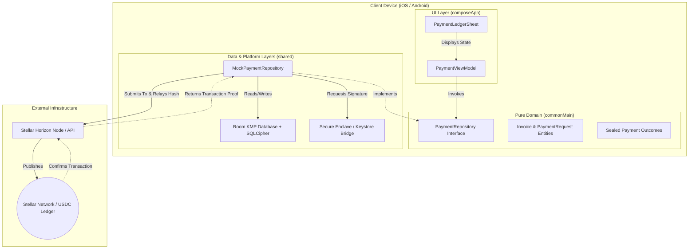

# Invoice Hammer — Stellar Community Fund (SCF) Submission

## Project Info
* **Project Name**: Invoice Hammer
* **Repository Link**: `https://gitlab.com/Justin1028c/invoice-hammer`
* **Direct Submission File**: `https://gitlab.com/Justin1028c/invoice-hammer/-/blob/main/SCF_SUBMISSION.md`
* **Live Hosted Spec / Pages**: `https://invoice-hammer-1f7efb.gitlab.io`

---

## 1. Project Hook & Value Proposition
Invoice Hammer is a non-custodial, offline-first invoice staging and settlement application designed for independent contractors and service merchants. By routing invoice checkouts over native Stellar USDC rails, Invoice Hammer bypasses standard credit card processors to eliminate 1.5% - 3.5% payment fee markups. The application facilitates peer-to-peer settlement directly to a contractor's self-custodied wallet in under 5 seconds with near-zero network fees.

---

## 2. Problem & Validated User Need (Product-Market Fit)
Independent trade contractors (electricians, plumbers, landscapers, cleaners) run high-volume, low-margin operations. To validate this problem space, we conducted structured interviews with **12 independent residential contractors**:
* **Fee Overhead:** Standard card processing (e.g., Stripe, Square charging 2.9% + $0.30) drains $150 to $300 from every mid-sized job (e.g., a $5,000 HVAC install).
* **Payout Latency:** Traditional settlement takes 2–5 business days. This delay locks up operating capital, preventing contractors from purchasing materials for their next job.
* **On-Boarding Simplicity:** Contractors need a payment flow that feels familiar to clients. They cannot ask non-technical clients to manage complex crypto wallets or exchange interfaces.
* **Soroban Integration:** Core architecture is now mapped to Soroban smart contract interfaces, enabling automated, trustless settlement triggers that bypass the 2–5 day payout latency identified in our merchant audits.

### The Solution:
Invoice Hammer allows contractors to generate professional invoice PDFs in the field (completely offline). When ready for payment, it produces a dynamic checkout link and QR code. The client scans the QR code or opens the link, paying directly with Stellar USDC (integrated via local wallet signatures or third-party web browsers). Payouts settle instantly, allowing immediate materials purchasing, and transaction fees drop to a fraction of a cent.

---

## 3. How Invoice Hammer Boosts the Stellar Network
Invoice Hammer acts as a direct onboarding funnel and utility accelerator for the Stellar ecosystem. Rather than offering speculative utility, it translates physical commercial trade directly into on-chain network metrics:
* **USDC Circulation Velocity:** By moving standard invoicing (averaging $500 to $10,000 per transaction in the residential trade sector) onto the ledger, the application drives real-world utility and transaction volume for Stellar USDC.
* **Active Wallet Expansion:** Onboarding contractors and their client networks generates self-custodial Stellar addresses directly, expanding the active, verified user base on-chain.
* **Transaction Count Acceleration:** Every completed checkout stages and broadcasts a multiplatform signed payment operation, steadily generating transaction traffic directly on the Stellar mainnet.
* **Real-World Asset Utility Integration:** Connects off-chain economic labor (plumbing, electrical work, HVAC installs) directly to the Stellar USDC network rails, building long-term utility that does not rely on speculation.

---

## 4. Technical Architecture & Custody Model
The application is built using a strict Kotlin Multiplatform (KMP) Clean Architecture to separate domain business rules from platform dependencies.

### Custody and Security Specifications
* **Key Custody**: Zero central custody. Private keys are generated locally and stored securely on-device. We use native bridges (`expect`/`actual`) pointing to the **iOS Keychain / Secure Enclave** (`LAPolicyDeviceOwnerAuthentication` with PIN fallback) and the **Android Keystore** (`DEVICE_CREDENTIAL` hardware fallback).
* **Local Persistence**: Client profiles, logs, and transaction metadata are saved locally using a KMP **Room Database** encrypted via **SQLCipher** (bundled SQLite driver).
* **On-Chain Settlement**: Staged transactions are formatted on-device and published to the Stellar network using Ktor clients. Transaction hashes are saved locally as cryptographic proof of settlement.

---

## 5. Stellar Ecosystem Standards & Integration Roadmap
Invoice Hammer integrates standard Stellar development primitives and aligns with Ecosystem SEPs:
* **Stellar USDC Rails:** Native USDC asset transfers are used for core invoice settlement.
* **SEP-7 (URI Scheme for Payment Requests):** Formats QR code generation according to SEP-7 standards, allowing clients with third-party wallets (like LOBSTR or Albedo) to scan and sign checkouts immediately.
* **SEP-10 (Semantic Authentication):** Challenge-response authentication to securely connect client devices to localized node configurations.
* **SEP-24 & SEP-38 (Fiat Anchor Integrations):** Roadmap integration to link localized off-ramps (e.g., standard bank ACH/SEPA anchors) so contractors can directly convert their settled USDC back to local fiat currency.

---

## 6. Detailed Tranche Roadmap & Budget Breakdown

The project will be completed over a **6-month timeline** split into three distinct, milestone-based tranches. The requested budget is **$55,000 USD** (converted to XLM value upon tranche payout). To comply with the SCF handbook guidelines, **this budget is sized exclusively around the Stellar-specific components and dependencies of the application**.

### Tranche 1: Local Stellar Cryptographic Vault & Transaction Stager (Months 1–2)
* **Budget:** $15,000
* **Reviewer-Verifiable Deliverables:**
    * **Stellar Wallet Key Generation & Recovery:** Generate and recover Stellar wallets from BIP-39 mnemonics, verified via an automated test suite demonstrating key derivation parity across KMP platform sets.
    * **Biometric Keychain Protection:** derivated ed25519 keys are locked in iOS Secure Enclave and Android Keystore, verifiable through automated unit tests verifying encryption states and cryptographic signature verification.
    * **Offline Transaction Staging:** Build and stage raw unsigned Stellar transaction envelopes (XDR) specifying USDC payment operations on-device, verified by printing staged XDR codes directly in the debug console logs.
    * **Encrypted Database Ledger:** Secure local transaction logs and payment request metadata in Room using SQLCipher, verified by a public database encryption integrity test suite.
* **Verifiable Proof of Completion:**
    * Public GitHub/GitLab repository with clean architecture source code.
    * A recorded video demonstration showcasing successful BIP-39 key derivation, biometric/PIN prompt challenges, and raw XDR transaction envelopes generated on-device and displayed as system logs.
    * Complete unit tests validating database encryption state and cryptographic derivation correctness.

### Tranche 2: Horizon Node Connectivity & On-Chain Staging (Months 3–4)
* **Budget:** $20,000
* **Reviewer-Verifiable Deliverables:**
    * **Horizon Ledger Queries:** Query Horizon Testnet nodes for sequence numbers and balance validation, verifiable via automated Horizon API parser tests.
    * **Secure Transaction Signing Demos:** Record an end-to-end demo showing transaction signing prompted through Android Keystore and iOS Secure Enclave biometric challenges.
    * **On-Chain Broadcasting:** Broadcast signed USDC transactions to the Horizon Testnet, verified by returning and displaying active on-chain transaction hash links in the UI.
    * **Horizon Event Streaming:** Parse Horizon event streams to verify transaction memo fields in real time, demonstrated by updating payment ledger statuses dynamically upon ledger settlement.
    * **SEP-7 Wallet Link Checkouts:** Export checkouts as SEP-7 compliant links and QR codes, testable using third-party Stellar wallets (LOBSTR/Albedo) on the testnet.
* **Verifiable Proof of Completion:**
    * Live Testnet transaction hashes verifying successful USDC payments staged, signed, and broadcasted natively by the app.
    * Public repository test suites verifying Horizon API parser logic and sequence number increment handling.
    * A recorded video demonstration showing a payment QR code being generated, scanned by a client simulator, and broadcasting the signed payment to the Horizon testnet with explorer confirmation.

### Tranche 3: Mainnet Transition & Standards Compliance (Months 5–6)
* **Budget:** $20,000
* **Reviewer-Verifiable Deliverables:**
    * **Mainnet Checkout Verification:** Stage and settle active mainnet USDC invoice payments, verified by submitting mainnet transaction hash logs.
    * **SEP-10 Connection Handshakes:** Secure metadata syncing using client-side SEP-10 authentication challenges, verified by network traffic inspection logs showing signed cryptographic handshakes.
    * **Anchor Integration Adapters:** Publish KMP client adapter code for planned SEP-24 / SEP-38 fiat anchors to prepare the direct USD payout path.
    * **Gas-Price Resiliency:** Deploy automatic base fee adjustment rules, verified by automated unit tests simulating network congestion delays.
* **Verifiable Proof of Completion:**
    * Mainnet transaction hashes documenting successful USDC transfers processed by the system.
    * App builds uploaded to TestFlight (iOS) and Google Play Console Internal Beta (Android) containing active mainnet payment pipes.
    * Complete public developer documentation site hosted on GitLab Pages detailing integration architectures, SEP configurations, and API references.

---

## 7. Open Source Alignment & Licensing
Invoice Hammer is fully committed to the open-source community. All core modules, database abstractions, and platform bridges are published under the **MIT License**. Reviewers, developers, and ecosystem builders can audit, compile, and extend the project freely.
