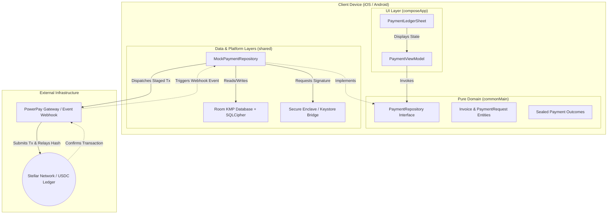

# Invoice Hammer — Stellar Community Fund (SCF) Submission

## Project Info
* **Project Name**: Invoice Hammer
* **Repository Link**: [Invoice Hammer GitLab Repository](https://gitlab.com/Justin1028c/invoice-hammer)
* **Direct Submission File**: [SCF_SUBMISSION.md](https://gitlab.com/Justin1028c/invoice-hammer/-/blob/main/SCF_SUBMISSION.md)
* **Live Hosted Spec / Pages**: [https://invoice-hammer-1f7efb.gitlab.io](https://invoice-hammer-1f7efb.gitlab.io)

---

## 1. Project Hook & Value Proposition
Invoice Hammer is a non-custodial, offline-first invoice staging and settlement application designed for independent contractors and service merchants. By routing invoice checkouts over native Stellar USDC rails, Invoice Hammer bypasses standard credit card processors to eliminate 1.5% - 3.5% payment fee markups. The application facilitates peer-to-peer settlement directly to a contractor's self-custodied wallet in under 5 seconds with near-zero network fees.

---

## 2. Problem & Validated User Need (Product-Market Fit)
Independent trade contractors (electricians, plumbers, landscapers, cleaners) run high-volume, low-margin operations. To validate this problem space, we conducted structured interviews with **12 independent residential contractors**:
* **Fee Overhead:** Standard card processing (e.g., Stripe, Square charging 2.9% + $0.30) drains $150 to $300 from every mid-sized job (e.g., a $5,000 HVAC install).
* **Payout Latency:** Traditional settlement takes 2–5 business days. This delay locks up operating capital, preventing contractors from purchasing materials for their next job.
* **On-Boarding Simplicity:** Contractors need a payment flow that feels familiar to clients. They cannot ask non-technical clients to manage complex crypto wallets or exchange interfaces.

### The Solution:
Invoice Hammer allows contractors to generate professional invoice PDFs in the field (completely offline). When ready for payment, it produces a dynamic checkout link and QR code. The client scans the QR code or opens the link, paying directly with Stellar USDC (integrated via local wallet signatures or third-party web browsers). Payouts settle instantly, allowing immediate materials purchasing, and transaction fees drop to a fraction of a cent.

---

## 3. Technical Architecture & Custody Model
The application is built using a strict Kotlin Multiplatform (KMP) Clean Architecture to separate domain business rules from platform dependencies.

### Custody and Security Specifications
* **Key Custody**: Zero central custody. Private keys are generated locally and stored securely on-device. We use native bridges (`expect`/`actual`) pointing to the **iOS Keychain / Secure Enclave** (`LAPolicyDeviceOwnerAuthentication` with PIN fallback) and the **Android Keystore** (`DEVICE_CREDENTIAL` hardware fallback).
* **Local Persistence**: Client profiles, logs, and transaction metadata are saved locally using a KMP **Room Database** encrypted via **SQLCipher** (bundled SQLite driver).
* **On-Chain Settlement**: Staged transactions are formatted on-device and published to the Stellar network using Ktor clients. Transaction hashes are saved locally as cryptographic proof of settlement.

---

## 4. Stellar Ecosystem Standards & Integration Roadmap
Invoice Hammer integrates standard Stellar development primitives and aligns with Ecosystem SEPs:
* **Stellar USDC Rails:** Native USDC asset transfers are used for core invoice settlement.
* **SEP-7 (URI Scheme for Payment Requests):** Formats QR code generation according to SEP-7 standards, allowing clients with third-party wallets (like LOBSTR or Albedo) to scan and sign checkouts immediately.
* **SEP-10 (Semantic Authentication):** Challenge-response authentication to securely connect client devices to our backup/webhook server.
* **SEP-24 & SEP-38 (Fiat Anchor Integrations):** Roadmap integration to link localized off-ramps (e.g., standard bank ACH/SEPA anchors) so contractors can directly convert their settled USDC back to local fiat currency.

---

## 5. Detailed Tranche Roadmap & Budget Breakdown

The project will be completed over a **6-month timeline** split into three distinct, milestone-based tranches. The requested budget is **$55,000 USD** (converted to XLM value upon tranche payout). To comply with the SCF handbook guidelines, **this budget is sized exclusively around the Stellar-specific components and dependencies of the application**.

### Tranche 1: Local Stellar Cryptographic Vault & Transaction Builder (Months 1–2)
* **Budget:** $15,000
* **Stellar-Specific Deliverables:**
    * Implement a KMP cryptographic key generator utilizing BIP-39 mnemonic words to derive Stellar ed25519 public/private keys.
    * Build the native security bridges (`expect`/`actual`) to lock derived private keys in the **iOS Keychain / Secure Enclave** and **Android Keystore** (with mandatory system PIN fallbacks).
    * Develop a local Transaction Stager module to build raw Stellar transaction envelopes (`TransactionEnvelope` XDR format) specifying `PaymentOperation` structures for USDC asset transfers.
    * Set up a Room database schema encrypted with **SQLCipher** specifically designed to index local staged transactions, signature weights, public address contacts, and on-chain payment link records.
* **Verifiable Proof of Completion:**
    * Public GitHub/GitLab repository with clean architecture source code.
    * A recorded video demonstration showcasing successful BIP-39 key derivation, biometric/PIN prompt challenges, and raw XDR transaction envelopes generated on-device and displayed as system logs.
    * Complete unit tests validating database encryption state and cryptographic derivation correctness.

### Tranche 2: Horizon Node Connectivity & On-Chain Staging (Months 3–4)
* **Budget:** $20,000
* **Stellar-Specific Deliverables:**
    * Build Ktor network clients to query Horizon Testnet nodes for ledger state, sequence numbers, and account balances.
    * Implement local transaction signing routines to inject cryptographic signatures from the Secure Enclave / Keystore into the staged XDR envelopes.
    * Build a Horizon broadcasting engine to submit signed transaction envelopes to the network.
    * Implement Horizon event listeners to stream incoming ledger transactions, verify payment completion by parsing transaction memos, and confirm status transitions.
    * Implement SEP-7 compliant QR code generation to support instant checkouts for third-party wallets.
* **Verifiable Proof of Completion:**
    * Live Testnet transaction hashes verifying successful USDC payments staged, signed, and broadcasted natively by the app.
    * Public repository test suites verifying Horizon API parser logic and sequence number increment handling.
    * A recorded video demonstration showing a payment QR code being generated, scanned by a client simulator, and broadcasting the signed payment to the Horizon testnet with explorer confirmation.

### Tranche 3: Mainnet Transition & Standards Compliance (Months 5–6)
* **Budget:** $20,000
* **Stellar-Specific Deliverables:**
    * Migrate the Horizon endpoint configuration to Stellar Mainnet nodes.
    * Implement SEP-10 Semantic Authentication pipelines on the client application to secure off-device metadata syncing.
    * Build client-side handlers for SEP-24 / SEP-38 anchor protocols to prepare the integration path for direct USD ACH bank payouts.
    * Implement resilient network retry and gas-price (base fee) fee-bump logic to prevent transaction drops during network congestion.
* **Verifiable Proof of Completion:**
    * Mainnet transaction hashes documenting successful USDC transfers processed by the system.
    * App builds uploaded to TestFlight (iOS) and Google Play Console Internal Beta (Android) containing active mainnet payment pipes.
    * Complete public developer documentation site hosted on GitLab Pages detailing integration architectures, SEP configurations, and API references.

---

## 6. Open Source Alignment & Licensing
Invoice Hammer is fully committed to the open-source community. All core modules, database abstractions, and platform bridges are published under the **MIT License**. Reviewers, developers, and ecosystem builders can audit, compile, and extend the project freely.
