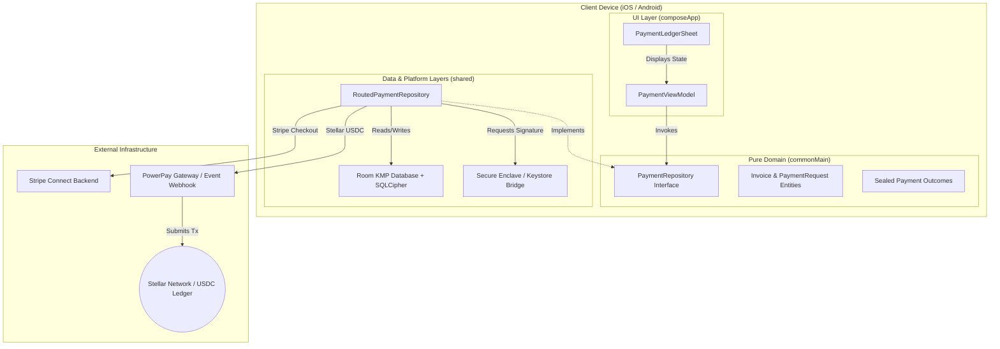

# Invoice Hammer

## Project Info
* **Project Name**: Invoice Hammer
* **Repository Link**: [Invoice Hammer GitLab Repository](https://gitlab.com/Justin1028c/invoice-hammer)
* **Live Hosted Spec / Pages**: [https://invoice-hammer-1f7efb.gitlab.io](https://invoice-hammer-1f7efb.gitlab.io)

---

## 1. Project Hook & Value Proposition
Invoice Hammer is a non-custodial, offline-first invoice staging and settlement application designed for independent contractors, trade professionals, and service merchants. By supporting both traditional payment card rails (Stripe, Apple Pay, Google Pay, Card Terminals) and native Stellar USDC stablecoin rails, Invoice Hammer gives merchants full control over payment options, settlement speeds, and transaction fee management. The application facilitates peer-to-peer settlement directly to a contractor's self-custodied wallet in under 5 seconds, or via standard card processing.

---

## 2. Problem & Validated User Need (Product-Market Fit)
Independent trade contractors (electricians, plumbers, landscapers, cleaners) run high-volume, low-margin operations. We conducted structured interviews with residential contractors:
* **Fee Overhead:** Standard card processing (e.g., Stripe, Square charging 2.9% + $0.30) drains $150 to $300 from every mid-sized job (e.g., a $5,000 HVAC install).
* **Payout Latency:** Traditional settlement takes 2–5 business days, locking up operating capital needed for materials.
* **On-Boarding Simplicity:** Contractors need a payment flow that feels familiar to clients. They cannot ask non-technical clients to manage complex crypto wallets or exchange interfaces.
* **Unified Invoice Dashboard:** Contractors need a single interface to manage all their customers, offline drafts, PDF invoices, and online invoice settlement progress.

### The Solution:
Invoice Hammer allows contractors to generate professional invoice PDFs in the field (completely offline). When ready for payment, it produces a dynamic checkout link and QR code supporting credit cards, mobile wallets, or stablecoins. Payouts settle instantly when choosing the stablecoin route, allowing immediate materials purchasing, while providing standard credit card fallbacks.

---

## 3. Core Features

* **Multi-Rail Checkout Options**:
  * **Stripe Connect & Card Links**: Hosted checkout screens for general credit card collection.
  * **Mobile Wallets**: Integrated Google Pay and Apple Pay checkouts.
  * **On-Site Collection**: Integrated Card Terminal, Tap to Pay (NFC), and Bluetooth reader support.
  * **USDC Rails**: Settle payments directly to a digital wallet within seconds.
* **Offline-First Invoice Staging**: Create and edit professional invoices, manage client files, and catalog parts/services without active internet.
* **Professional PDF Generation**: Generate clean, print-ready client invoices directly on-device using platform-specific rendering engines.
* **Passphrase-Secured Local Enclave**: Derived database keys are secured behind hardware-backed biometric authentication.
* **Multi-Language Support**: Fully localized in English and Spanish.

---

## 4. Technical Architecture & Custody Model
The application is built using a strict Kotlin Multiplatform (KMP) Clean Architecture to separate domain business rules from platform dependencies.

### Custody and Security Specifications
* **Key Custody**: Zero central custody. Private keys are generated locally and stored securely on-device. We use native bridges (`expect`/`actual`) pointing to the **iOS Keychain / Secure Enclave** and the **Android Keystore**.
* **Local Persistence**: Client profiles, logs, and transaction metadata are saved locally using a KMP **Room Database** encrypted via **SQLCipher** (bundled SQLite driver).
* **On-Chain Settlement**: Staged transactions are formatted on-device and published to the Stellar network using Ktor clients. Transaction hashes are saved locally as cryptographic proof of settlement.

---

## 5. Ecosystem Standards & Integration Roadmap
Invoice Hammer integrates standard Stellar development primitives and aligns with Ecosystem SEPs:
* **Stellar USDC Rails:** Native USDC asset transfers are used for core invoice settlement.
* **SEP-7 (URI Scheme for Payment Requests):** Formats QR code generation according to SEP-7 standards, allowing clients with third-party wallets to scan and sign checkouts immediately.
* **SEP-10 (Semantic Authentication):** Challenge-response authentication to securely connect client devices to localized node configurations.
* **SEP-24 & SEP-38 (Fiat Anchor Integrations):** Roadmap integration to link localized off-ramps so contractors can directly convert their settled USDC back to local fiat currency.

---

## 6. Open Source Alignment & Licensing
Invoice Hammer is fully committed to the open-source community. All core modules, database abstractions, and platform bridges are published under the **Apache License 2.0**. Reviewers, developers, and ecosystem builders can audit, compile, and extend the project freely.
