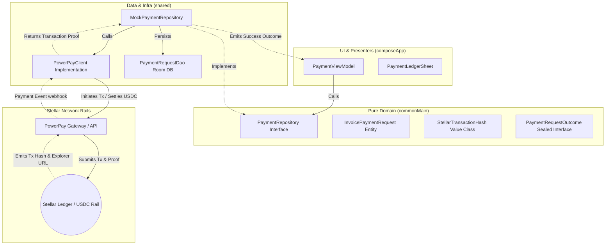

# Invoice Hammer

## The Hook
Invoice Hammer is a non-custodial, peer-to-peer business management and billing platform designed for independent contractors. By combining offline-first job documentation, AI-powered field capture, and direct on-chain Stellar USDC rails, Invoice Hammer eliminates expensive middleman markups (1.5% - 3.5%) and streamlines the entire freelance project lifecycle from first contract to final settlement.

> **AUDIT PROOF**: Skip the overview and review the implementation directly! The complete, compilable Kotlin Multiplatform (KMP) codebase and platform bridges are publicly hosted here: [Invoice Hammer GitLab Codebase](https://gitlab.com/Justin1028c/invoice-hammer). Use this repository as cryptographic and architectural proof of implementation.

---

## The End-to-End Contractor Workflow
Invoice Hammer is more than a simple invoicing tool—it captures and secures a contractor's entire field operations workflow:

### 1. Job Site Documentation & Logging
* **Offline-First Records**: Log clients, job details, and material notes directly in the field with zero cellular connection.
* **Encrypted On-Device Database**: Client directories, invoices, and job histories are stored locally using a **Room KMP database** encrypted with **SQLCipher** for military-grade privacy.

### 2. AI-Powered Field Capture
* **Voice-Driven Actions**: Create invoices, add items, and update client logs verbally using the integrated **Gemini / Foreman Voice Agent** (via local audio capture and secure cloud functions).
* **Smart OCR Expense Scanning**: Snap photos of hardware receipts and automatically parse line items into your logs using on-device Gemini vision processing.

### 3. Professional Invoice Staging
* **Custom PDF Generation**: Instantly generate professional, localized PDFs for material summaries and labor bills on-device.
* **Granular Tracking**: Invoices transit a clean state lifecycle (`Requested` ➡️ `Pending` ➡️ `Paid` ➡️ `Failed`) logged in your local ledger.

### 4. Dynamic Dual-Rail Checkout
* **Stellar USDC Rails**: Generate non-custodial checkout links where clients pay on-chain, settling directly into your private wallet in under 5 seconds with zero platform markup.
* **On-Site Payment Sheet**: Accept Apple Pay, Google Pay, and physical card reader terminals via integrated mobile payment rails for clients who prefer traditional cards.

### 5. Secure Cloud Synchronization
* **Supabase Synchronization**: Backup your local database, sync changes across multiple devices, and handle incoming payment webhooks safely using peer-to-peer cloud staging.

---

## Clean Architecture Boundary & Stellar Transaction Flow
Invoice Hammer is architected as a pure Kotlin Multiplatform (KMP) system. The core domain logic is strictly decoupled from platform frameworks and external APIs, enforcing boundaries using strong value classes and sealed operation interfaces.

---

## Key Innovation Features
* **Pure Domain Boundary**: Zero platform-specific imports permitted inside the `commonMain` business core.
* **Primitive Obsession Eradicated**: Representation of critical domain concepts (IDs, amounts, transaction hashes) via `@JvmInline value class` wrappers.
* **Exhaustive Sealed Interop**: Operation outcomes use typed sealed interfaces ensuring Swift-safe interoperability without exceptions.
