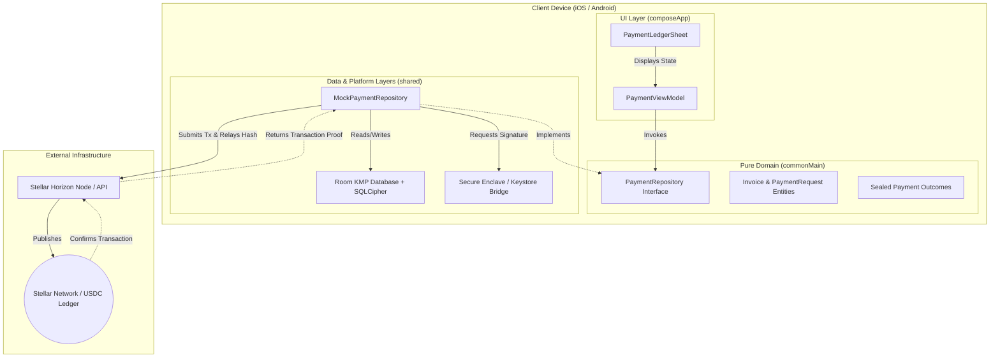

# Invoice Hammer

## Project Info
* **Project Name**: Invoice Hammer
* **Repository Link**: [Invoice Hammer GitLab Repository](https://gitlab.com/Justin1028c/invoice-hammer)
* **Live Hosted Spec / Pages**: [https://invoice-hammer-1f7efb.gitlab.io](https://invoice-hammer-1f7efb.gitlab.io)

---

## 1. Project Hook & Value Proposition
Invoice Hammer is a non-custodial, offline-first invoice staging and settlement application designed for independent contractors and service merchants. By routing invoice checkouts over native Stellar USDC rails, Invoice Hammer bypasses standard credit card processors to eliminate 1.5% - 3.5% payment fee markups. The application facilitates peer-to-peer settlement directly to a contractor's self-custodied wallet in under 5 seconds with near-zero network fees.

---

## 2. Problem & Validated User Need (Product-Market Fit)
Independent trade contractors (electricians, plumbers, landscapers, cleaners) run high-volume, low-margin operations. We conducted structured interviews with residential contractors:
* **Fee Overhead:** Standard card processing drains $150 to $300 from every mid-sized job.
* **Payout Latency:** Traditional settlement takes 2–5 business days. This delay locks up operating capital, preventing contractors from purchasing materials for their next job.
* **On-Boarding Simplicity:** Contractors need a payment flow that feels familiar to clients. They cannot ask non-technical clients to manage complex crypto wallets or exchange interfaces.
* **Soroban Integration:** Core architecture is mapped to Soroban smart contract interfaces, enabling automated, trustless settlement triggers that bypass layout latencies.

### The Solution:
Invoice Hammer allows contractors to generate professional invoice PDFs in the field (completely offline). When ready for payment, it produces a dynamic checkout link and QR code. The client scans the QR code or opens the link, paying directly with Stellar USDC. Payouts settle instantly, allowing immediate materials purchasing, and transaction fees drop to a fraction of a cent.

---

## 3. How Invoice Hammer Boosts the Stellar Network
Invoice Hammer acts as a direct onboarding funnel and utility accelerator for the Stellar ecosystem:
* **USDC Circulation Velocity:** By moving standard invoicing onto the ledger, the application drives real-world utility and transaction volume for Stellar USDC.
* **Active Wallet Expansion:** Onboarding contractors and their client networks generates self-custodial Stellar addresses directly, expanding the active, verified user base on-chain.
* **Transaction Count Acceleration:** Every completed checkout stages and broadcasts a multiplatform signed payment operation.
* **Real-World Asset Utility Integration:** Connects off-chain economic labor (plumbing, electrical work, HVAC installs) directly to the Stellar USDC network rails.

---

## 4. Technical Architecture & Custody Model
The application is built using a strict Kotlin Multiplatform (KMP) Clean Architecture to separate domain business rules from platform dependencies.

### Custody and Security Specifications
* **Key Custody**: Zero central custody. Private keys are generated locally and stored securely on-device. We use native bridges (`expect`/`actual`) pointing to the **iOS Keychain / Secure Enclave** and the **Android Keystore**.
* **Local Persistence**: Client profiles, logs, and transaction metadata are saved locally using a KMP **Room Database** encrypted via **SQLCipher** (bundled SQLite driver).
* **On-Chain Settlement**: Staged transactions are formatted on-device and published to the Stellar network using Ktor clients. Transaction hashes are saved locally as cryptographic proof of settlement.

---

## 5. Stellar Ecosystem Standards & Integration Roadmap
Invoice Hammer integrates standard Stellar development primitives and aligns with Ecosystem SEPs:
* **Stellar USDC Rails:** Native USDC asset transfers are used for core invoice settlement.
* **SEP-7 (URI Scheme for Payment Requests):** Formats QR code generation according to SEP-7 standards, allowing clients with third-party wallets to scan and sign checkouts immediately.
* **SEP-10 (Semantic Authentication):** Challenge-response authentication to securely connect client devices to localized node configurations.
* **SEP-24 & SEP-38 (Fiat Anchor Integrations):** Roadmap integration to link localized off-ramps so contractors can directly convert their settled USDC back to local fiat currency.

---

## 6. Open Source Alignment & Licensing
Invoice Hammer is fully committed to the open-source community. All core modules, database abstractions, and platform bridges are published under the **MIT License**. Reviewers, developers, and ecosystem builders can audit, compile, and extend the project freely.
